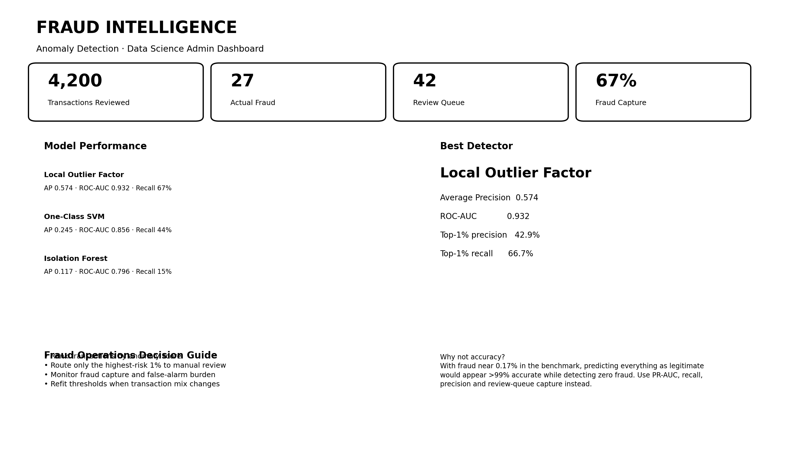
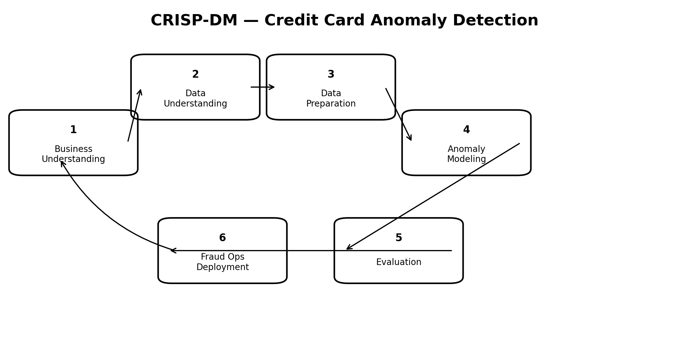
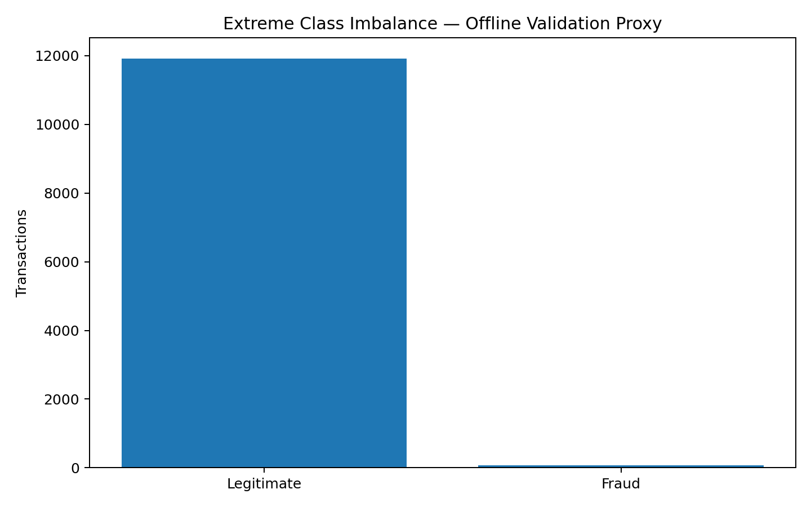
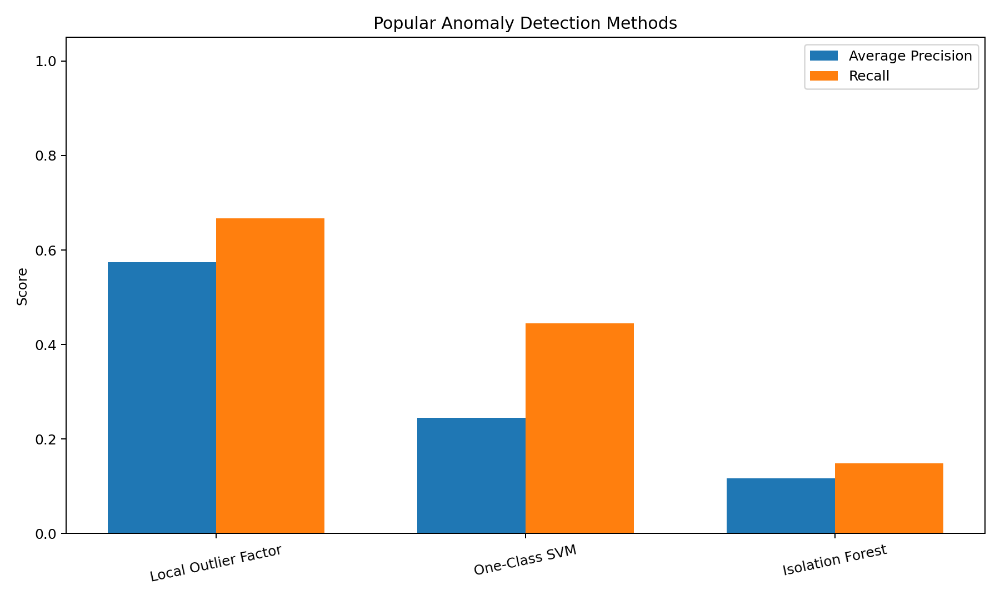
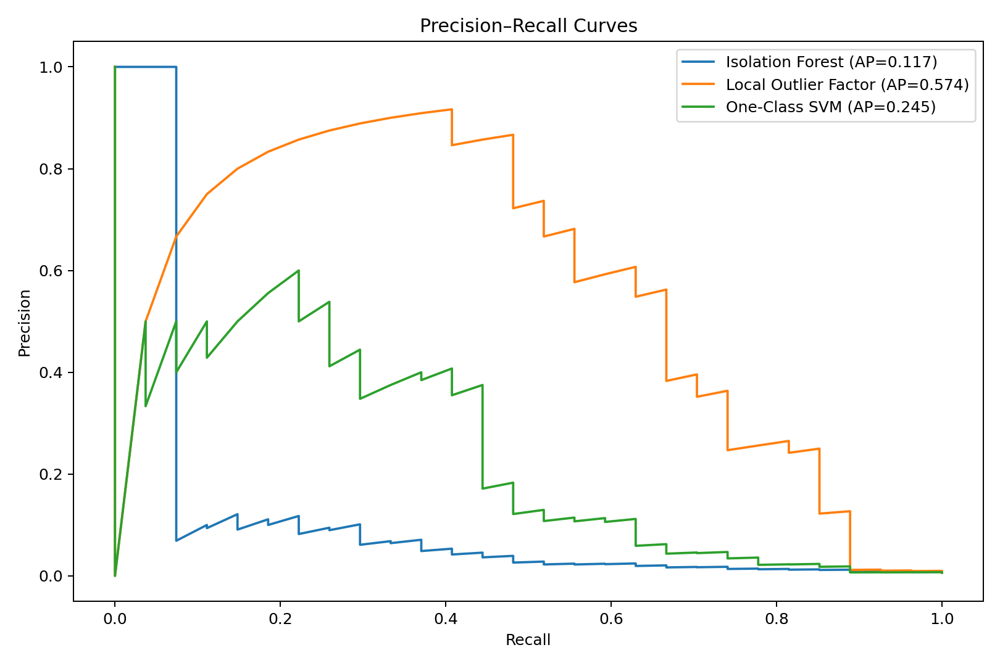
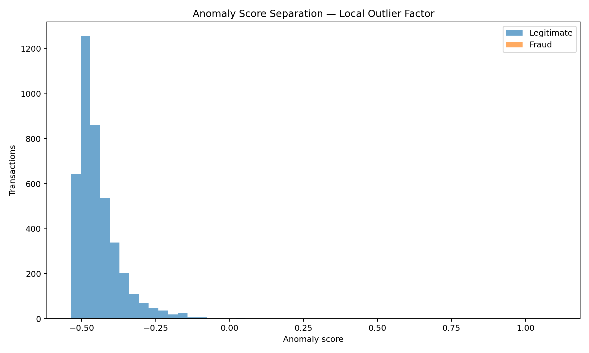
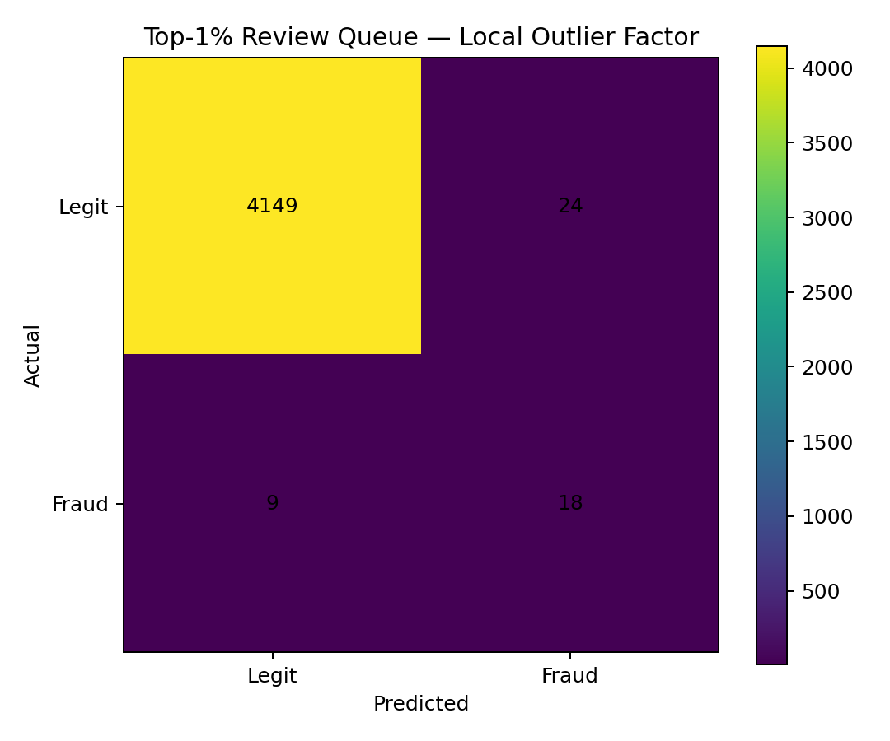

# 💳 Credit Card Anomaly Detection

> CRISP-DM fraud analytics project using **Isolation Forest, Local Outlier Factor, and One-Class SVM** on the popular Kaggle / ULB Credit Card Fraud Detection benchmark.



## Dataset

The Kaggle benchmark contains **284,807 transactions**, including **492 fraud cases (0.172%)**.

Features:
- `Time`
- `Amount`
- `V1`–`V28` anonymized PCA components
- `Class` target used only for evaluation

The notebook attempts to load the full public benchmark from **OpenML dataset 1597**. If internet access is unavailable, it uses a clearly labeled offline validation proxy so the notebook remains runnable.

## CRISP-DM



### 1. Business Understanding
Detect unusual transactions and prioritize a small investigation queue.

### 2. Data Understanding
Study extreme class imbalance, transaction amounts, missingness, and feature structure.

### 3. Data Preparation
- separate labels from modeling features
- robust-scale `Time` and `Amount`
- keep PCA features
- fit anomaly detectors on normal behavior
- reserve labels for evaluation

### 4. Modeling
Popular anomaly methods:
- **Isolation Forest**
- **Local Outlier Factor**
- **One-Class SVM**

### 5. Evaluation
Use fraud-aware metrics:
- Average Precision / PR-AUC
- ROC-AUC
- precision
- recall
- F1
- top-k fraud capture

### 6. Deployment
Use anomaly scores to build a ranked fraud-review queue and adjust the threshold to investigator capacity.

## Offline validation run

The repository pipeline was validated end-to-end in this environment using the explicitly labeled offline proxy because direct benchmark binary download was unavailable here.

| Model | Average Precision | ROC-AUC | Precision | Recall | F1 | Flagged |
|---|---:|---:|---:|---:|---:|---:|
| Local Outlier Factor | 0.5738 | 0.9318 | 0.4286 | 0.6667 | 0.5217 | 42 |
| One-Class SVM | 0.2454 | 0.8556 | 0.2857 | 0.4444 | 0.3478 | 42 |
| Isolation Forest | 0.1169 | 0.7956 | 0.0952 | 0.1481 | 0.1159 | 42 |

**Best offline-validation detector:** Local Outlier Factor  
**Top-1% precision:** 42.9%  
**Top-1% fraud recall:** 66.7%

> These offline-validation metrics are **not claimed as Kaggle benchmark results**. Run the notebook online to evaluate on the full OpenML/Kaggle dataset.

## Dashboard


## Visuals

### Class imbalance


### Model comparison


### Precision–Recall curves


### Anomaly score separation


### Review-queue confusion matrix


## Repository structure

```text
credit_card_anomaly_detection_github_ready/
├── credit_card_anomaly_detection.ipynb
├── README.md
├── prompt_used.md
└── images/
    ├── admin_dashboard.png
    ├── anomaly_score_distribution.png
    ├── class_imbalance.png
    ├── confusion_matrix.png
    ├── crisp_dm_workflow.png
    ├── model_comparison.png
    └── precision_recall_curves.png
```

## Why accuracy is intentionally not emphasized

With fraud at roughly **0.17%**, a system that predicts every transaction as legitimate would appear more than 99% accurate while catching no fraud.

For real fraud operations, **PR-AUC, recall, precision, and top-k capture** are more meaningful.

## Run

Open the notebook in **Jupyter** or **Google Colab** and run all cells.

When internet access is available, it automatically requests the full public benchmark via:

```python
fetch_openml(data_id=1597, as_frame=True)
```

## Business use

The model output is best treated as a ranked risk queue:

1. score transactions;
2. rank suspicious activity;
3. investigate the highest-risk 1%;
4. monitor fraud capture and false positives;
5. adjust review capacity and thresholds;
6. retrain as behavior changes.

## Limitations

- anomaly ≠ fraud;
- unsupervised detectors may flag legitimate unusual behavior;
- transaction behavior changes over time;
- thresholds should reflect business costs and investigator capacity;
- labels should never leak into anomaly-model fitting.
