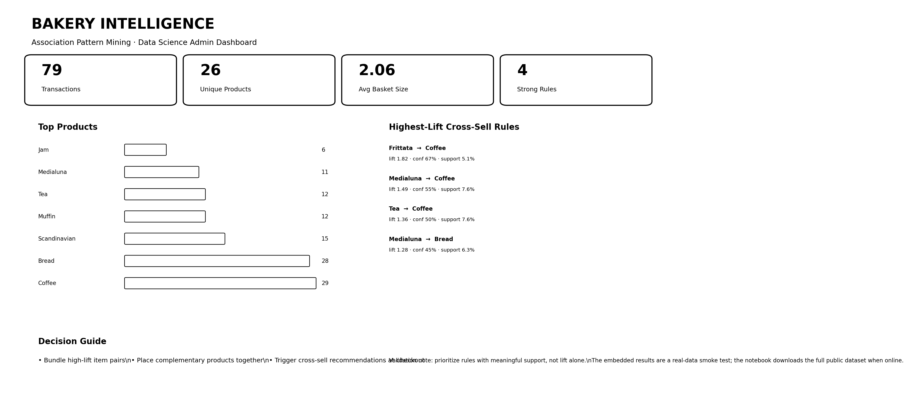
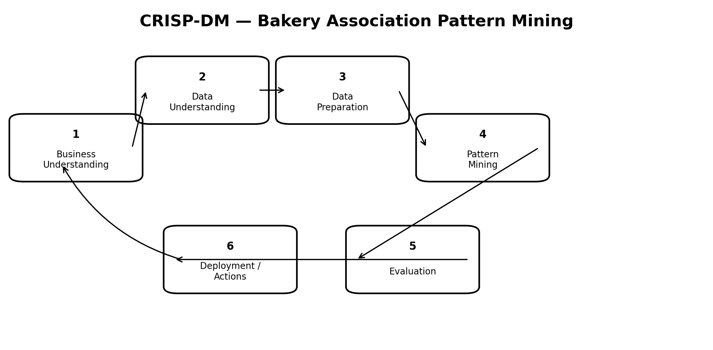
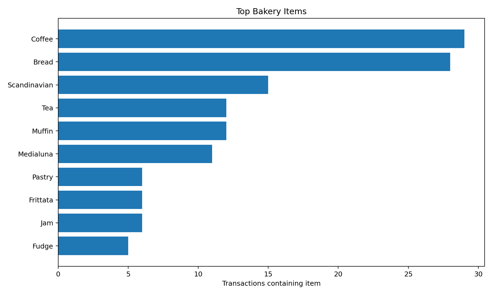
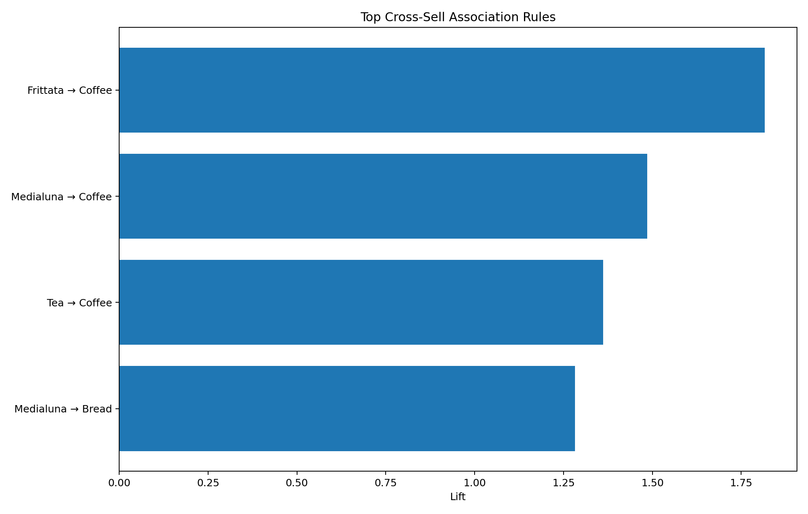
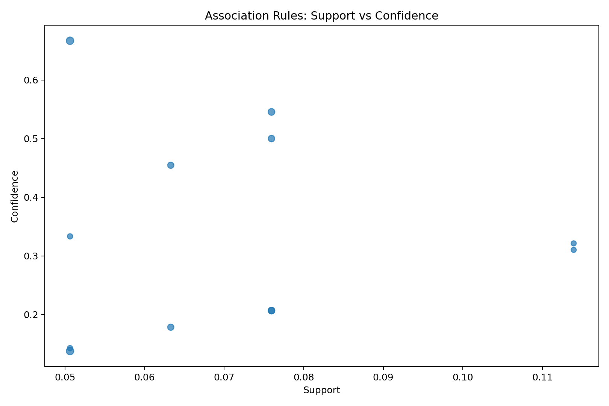
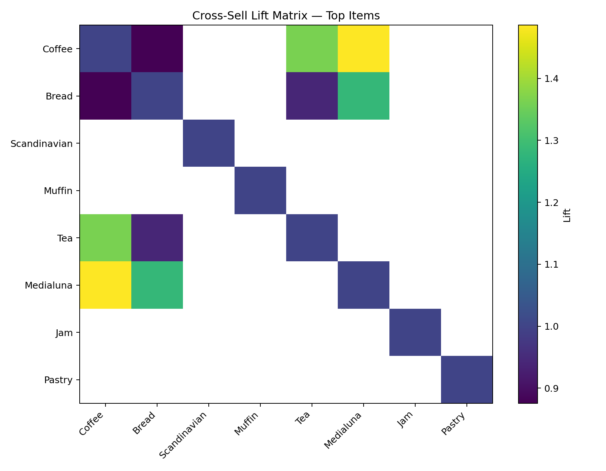

# 🥐 Bakery Association Pattern Mining

> End-to-end **Market Basket Analysis** using CRISP-DM, frequent itemsets, and association rules.



## Project summary

This project uses the popular **Bread Basket / Bakery Sales** dataset, commonly used on Kaggle for market-basket analysis.

The public dataset contains more than **20,000 item records** and **9,000+ transactions**. The notebook automatically downloads the full public CSV when internet access is available and includes a small real-data fallback for reproducibility.

## CRISP-DM



### 1. Business Understanding
Discover product combinations that can support bundles, recommendations, menu placement, and cross-selling.

### 2. Data Understanding
Inspect transactions, products, duplicates, placeholder records, time structure, and item frequency.

### 3. Data Preparation
- Remove `NONE`
- Trim product labels
- De-duplicate product appearances within a basket
- Build transaction-level baskets

### 4. Modeling
Mine frequent itemsets and derive association rules using:
- support
- confidence
- lift
- leverage
- conviction

### 5. Evaluation
Prioritize rules with both sufficient support and positive lift instead of choosing rules by lift alone.

### 6. Deployment
Turn rules into:
- product bundles
- checkout recommendations
- cross-sell campaigns
- product placement tests

## Executed smoke-test result

The bundled notebook was validated with a **real excerpt** from the same Bread Basket transaction source.

- Transactions: **79**
- Unique products: **26**
- Average basket size: **2.06**
- Candidate strong rules: **4**
- Highest-lift candidate: `Frittata → Coffee` (lift **1.82**, confidence **67%**)

> The README does not present the real-data fallback result as a full-dataset benchmark. Run the notebook online to mine the complete dataset.

## Dashboard


## Visual analysis

### Top items


### Strongest rules


### Rule quality


### Lift matrix


## Repository structure

```text
bakery_association_mining_github_ready/
├── bakery_association_pattern_mining.ipynb
├── README.md
├── prompt_used.md
└── images/
    ├── admin_dashboard.png
    ├── crisp_dm_workflow.png
    ├── lift_matrix.png
    ├── rule_scatter.png
    ├── top_items.png
    └── top_rules.png
```

## Run

Open the notebook in Jupyter or Google Colab and run all cells.

The notebook has no special association-mining dependency; it implements the required calculations directly with Python/Pandas.

## Business interpretation

- **Support** tells us whether a pattern is common enough to matter.
- **Confidence** tells us how often B occurs when A occurs.
- **Lift > 1** means A and B occur together more often than expected under independence.

A strong retail recommendation should balance all three.

## Limitations

- Association does not imply causation.
- Rare-item rules can have inflated lift.
- Product availability and seasonality may affect patterns.
- Business actions should be validated with controlled experiments.
