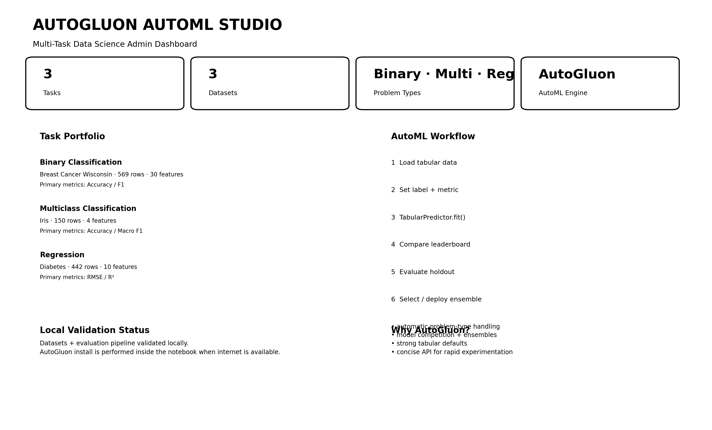
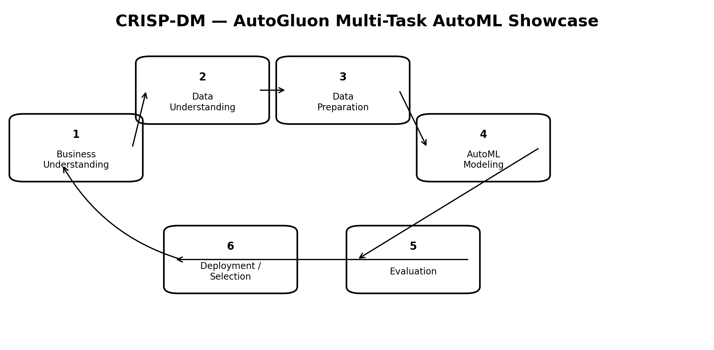
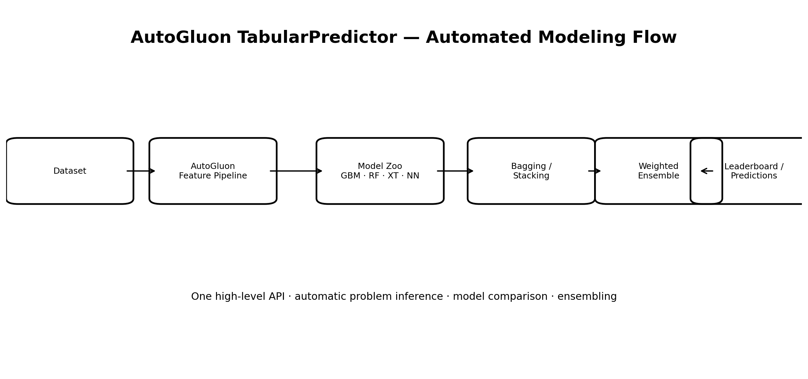
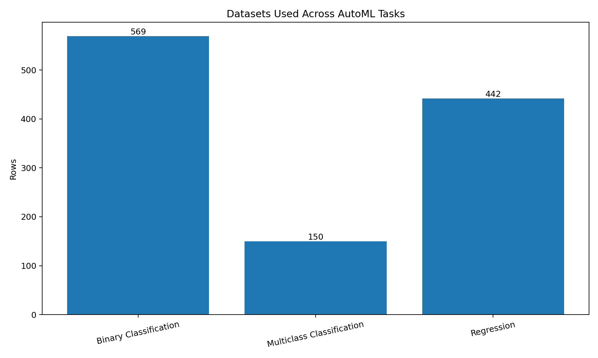
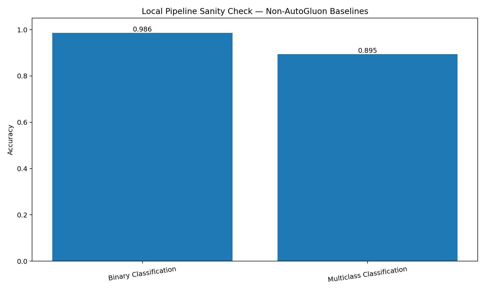

# 🤖 AutoML with AutoGluon — Multi-Task Showcase

> A compact CRISP-DM project demonstrating **AutoGluon TabularPredictor** across binary classification, multiclass classification, and regression.



## What this project demonstrates

One AutoML framework applied to three classic data-science tasks:

| Task | Dataset | Goal |
|---|---|---|
| Binary Classification | Breast Cancer Wisconsin | Predict one of two diagnostic classes |
| Multiclass Classification | Iris | Predict one of three flower classes |
| Regression | Diabetes | Predict a continuous progression score |

AutoGluon's `TabularPredictor` supports binary classification, multiclass classification, regression, and quantile tasks, and can automatically infer problem type when it is not specified.

## CRISP-DM



### 1. Business Understanding
Define what success means for each task and choose metrics that match the decision.

### 2. Data Understanding
Inspect target structure, feature count, row count, missingness, and class balance.

### 3. Data Preparation
Standardize the target name and create holdout sets. AutoGluon handles much of the downstream tabular preprocessing automatically.

### 4. Modeling
Use the same high-level API:

```python
predictor = TabularPredictor(
    label="label",
    problem_type="binary",
    eval_metric="accuracy"
).fit(
    train_data,
    presets="medium",
    time_limit=60
)
```

Repeat with `multiclass` and `regression`.

### 5. Evaluation
Compare:
- leaderboard score
- holdout metric
- model family
- fit time
- prediction time
- ensemble benefit

### 6. Deployment / Selection
Choose a model based on accuracy **and** operational constraints such as latency, explainability, model size, and retraining cost.

## AutoGluon architecture



AutoGluon automates model training, model comparison, stacking/bagging, and weighted ensembling behind a concise API.

## Admin Dashboard


## Dataset portfolio



## Local environment validation



The datasets and evaluation pipeline were validated locally with conventional sklearn baselines.

**Important:** these local baseline values are deliberately **not presented as AutoGluon results**. This workspace could not reach PyPI, so AutoGluon itself could not be installed here.

The notebook solves that automatically in an internet-enabled environment:

```python
pip install autogluon.tabular==1.6.1
```

Then it runs all three actual `TabularPredictor` experiments and displays the AutoGluon leaderboards.

## Recommended way to run

Open `autogluon_automl_showcase.ipynb` in **Google Colab** and choose **Run all**.

The notebook:
1. checks whether AutoGluon is installed;
2. installs it when necessary;
3. loads all three datasets;
4. trains AutoGluon for each problem;
5. prints model leaderboards;
6. evaluates holdout performance.

## Repository structure

```text
autogluon_automl_showcase_github_ready/
├── autogluon_automl_showcase.ipynb
├── README.md
├── prompt_used.md
└── images/
    ├── admin_dashboard.png
    ├── autogluon_architecture.png
    ├── baseline_validation.png
    ├── crisp_dm_workflow.png
    └── task_overview.png
```

## Why this is useful

Traditional experimentation might require manually building pipelines for:
- logistic regression
- random forests
- boosted trees
- neural networks
- hyperparameter search
- ensembling

AutoGluon reduces this to a few lines while still exposing the leaderboard so the data scientist can inspect what actually won.

## Key lesson

**AutoML automates modeling—not data science.**

CRISP-DM is still necessary for:
- defining the problem;
- checking data quality;
- selecting the right metric;
- avoiding leakage;
- interpreting results;
- deciding what can safely be deployed.

## AutoGluon version

Notebook target: **AutoGluon Tabular 1.6.1**.
