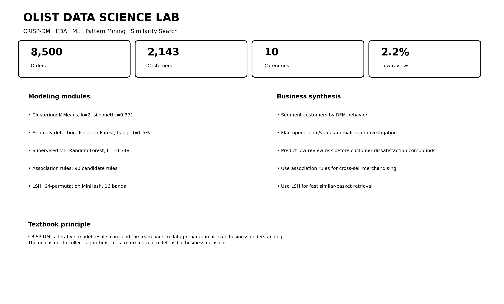
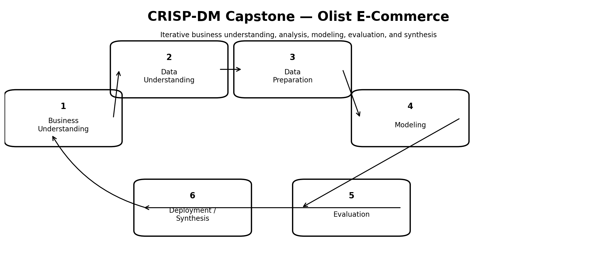
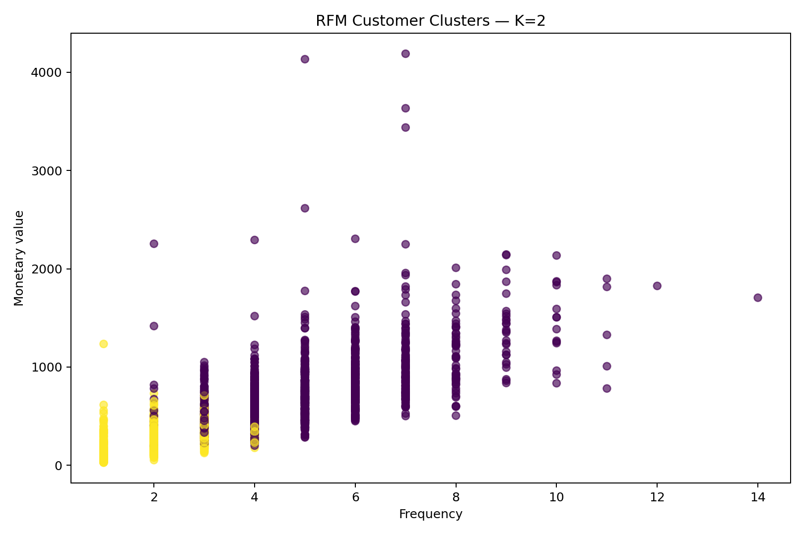
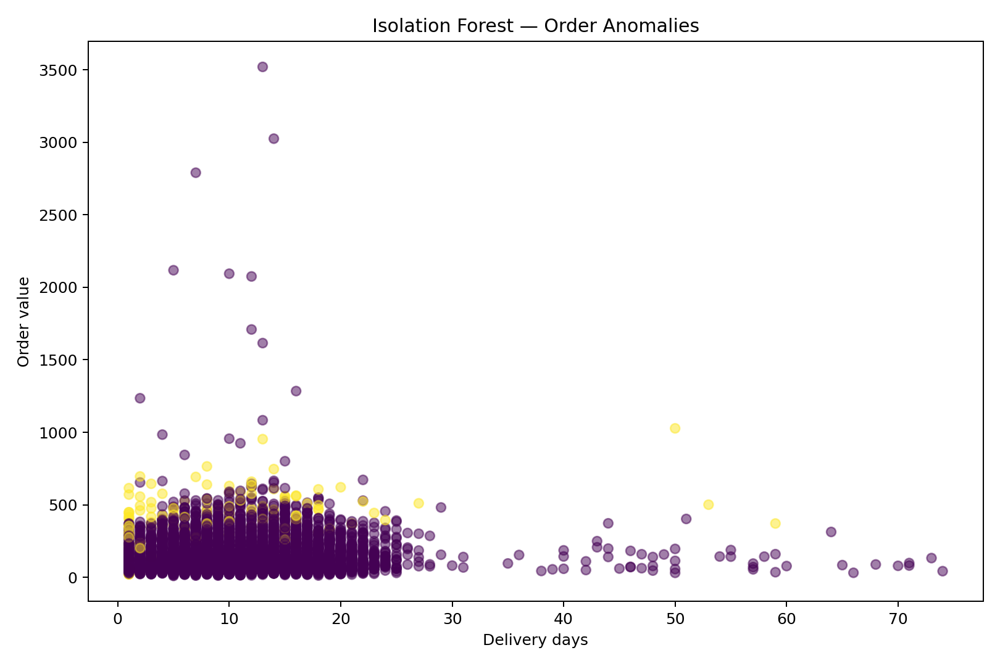
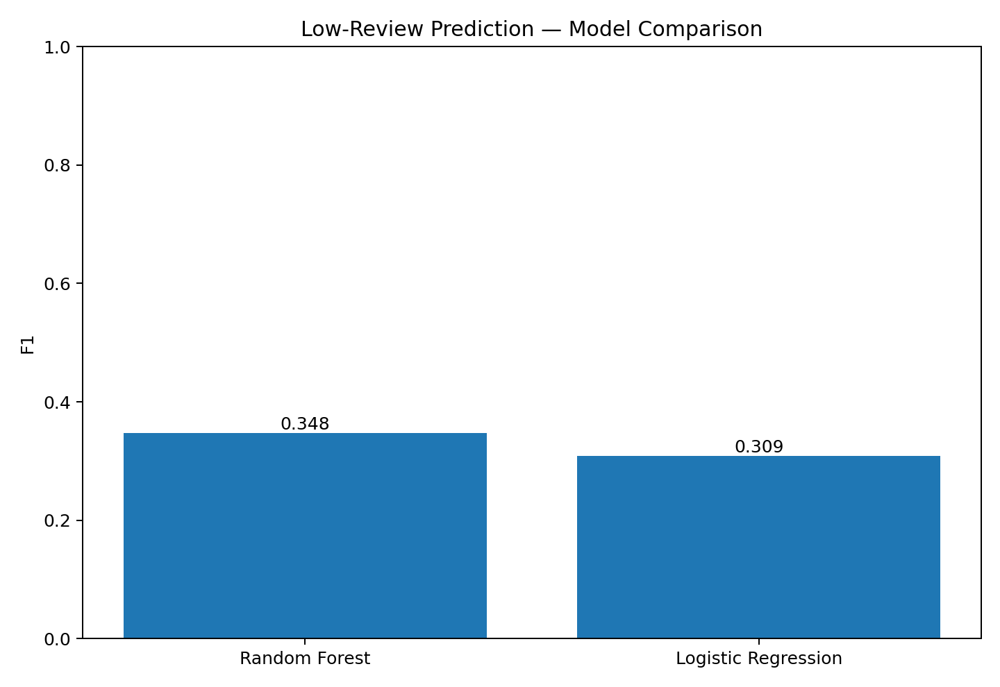
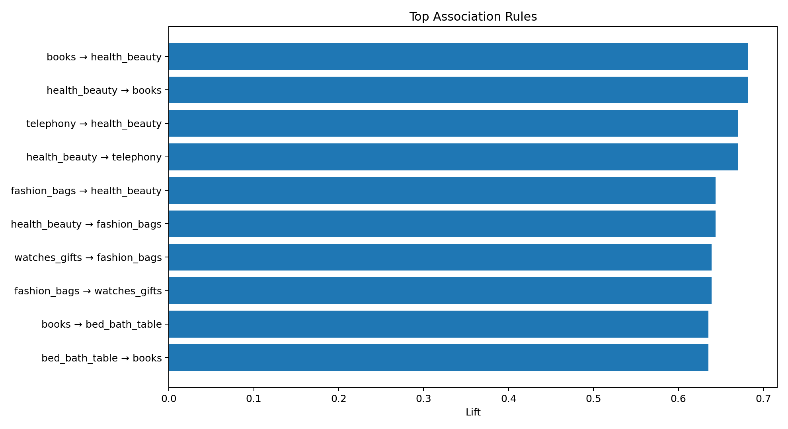
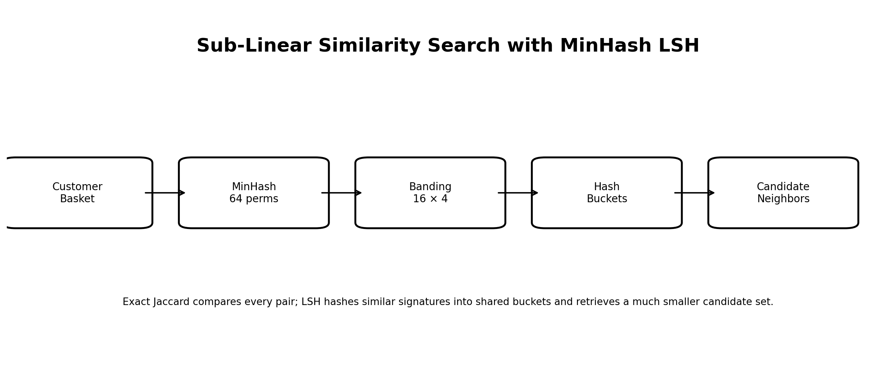
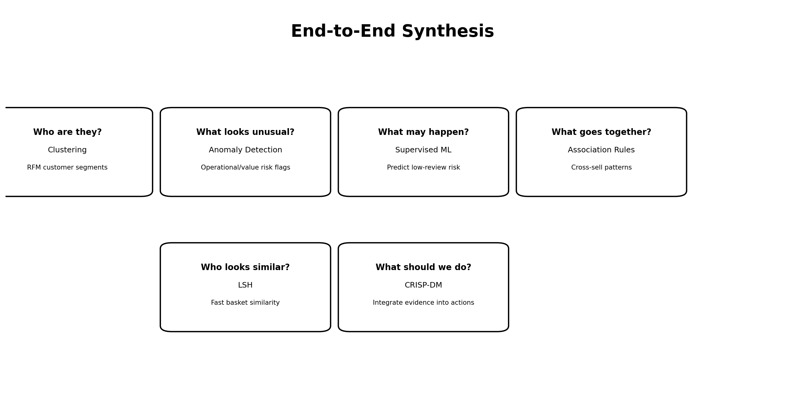

# 📘 CRISP-DM Textbook Capstone — Olist E-Commerce

A complete end-to-end data science capstone using the popular **Brazilian E-Commerce Public Dataset by Olist**.



## What this project teaches

- CRISP-DM in textbook depth
- quizzes with answer keys
- exploratory data analysis
- preprocessing and leakage prevention
- K-Means clustering
- Isolation Forest anomaly detection
- supervised classification
- association rule mining
- MinHash Locality-Sensitive Hashing (LSH)
- evaluation and monitoring
- final cross-method synthesis

## Dataset

The original Kaggle Olist dataset contains about **100,000 anonymized marketplace orders from 2016–2018** and includes customer, order, item, payment, review, product, seller, and geolocation tables.

The notebook automatically uses real Kaggle CSVs when they are placed beside the notebook. It includes a deterministic Olist-shaped fallback solely for execution/reproducibility when Kaggle files are unavailable.

> Fallback metrics are not Kaggle benchmark results.

## CRISP-DM



### 1. Business Understanding
Defines one coherent e-commerce decision system and connects each analytical method to a real business question.

### 2. Data Understanding
Covers grain, joins, missingness, duplicate keys, time ranges, distributions, quality rules, and multi-table fanout.

### 3. Data Preparation
Builds task-specific representations, features, and leakage-safe pipelines.

### 4. Modeling
Includes:
- K-Means RFM clustering
- Isolation Forest
- Logistic Regression
- Random Forest
- association rules
- MinHash + LSH

### 5. Evaluation
Separates technical metrics from business usefulness and process validity.

### 6. Deployment / Synthesis
Defines a deployment and monitoring pattern for each analytical output.

## Executed local validation

The complete algorithms were executed locally on a deterministic Olist-shaped fallback.

| Module | Result |
|---|---|
| Clustering | K=2, silhouette **0.371** |
| Anomaly detection | **1.51%** flagged |
| Supervised ML | Random Forest, F1 **0.348** |
| Association mining | **90** retained pair rules |
| LSH | 64 MinHash permutations, 16 bands |

These numbers validate the pipeline but are intentionally **not** presented as Kaggle results.

## Visuals

### Customer clustering


### Anomaly detection


### Supervised models


### Association rules


### LSH


### Final synthesis


## Quizzes

Every major concept contains a short quiz with a collapsible answer key, including:

- CRISP-DM
- business understanding
- data understanding
- preprocessing/leakage
- clustering
- anomaly detection
- supervised learning
- association rules
- MinHash/LSH
- evaluation
- synthesis

## Repository structure

```text
olist_crispdm_textbook_github_ready/
├── olist_crispdm_textbook_capstone.ipynb
├── README.md
├── prompt_used.md
└── images/
    ├── admin_dashboard.png
    ├── anomaly_detection.png
    ├── association_rules.png
    ├── crisp_dm_workflow.png
    ├── customer_clusters.png
    ├── lsh_pipeline.png
    ├── supervised_model_comparison.png
    └── synthesis_map.png
```

## Core lesson

This project is deliberately broader than a model-comparison notebook.

It teaches that professional data science is the complete reasoning chain:

**business decision → trustworthy data → appropriate representation → appropriate method → valid evaluation → operational action → monitoring → iteration.**
