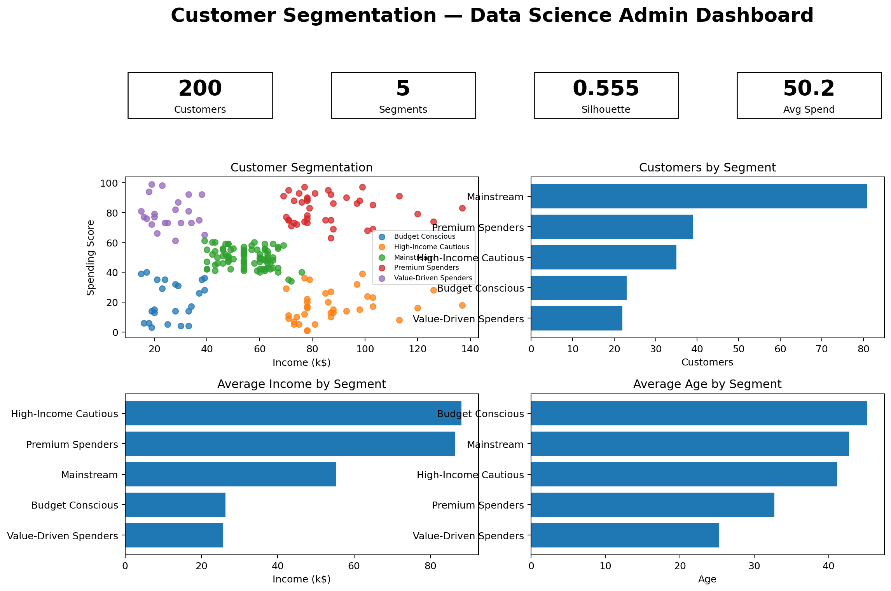
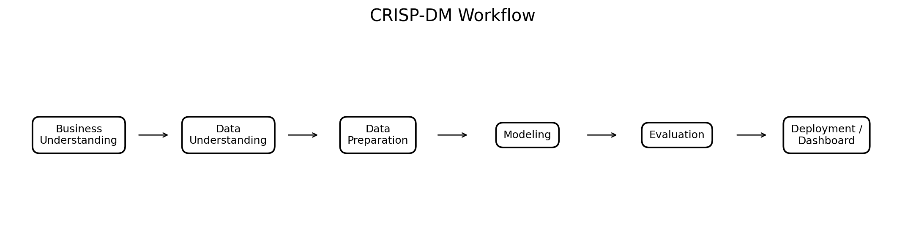
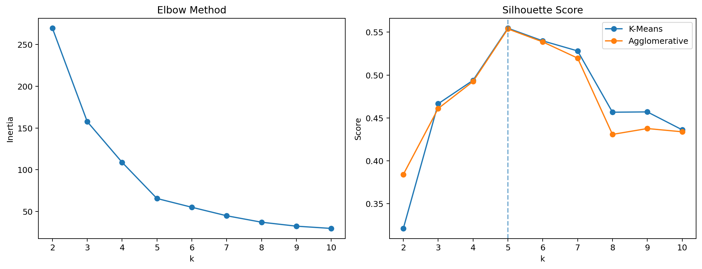
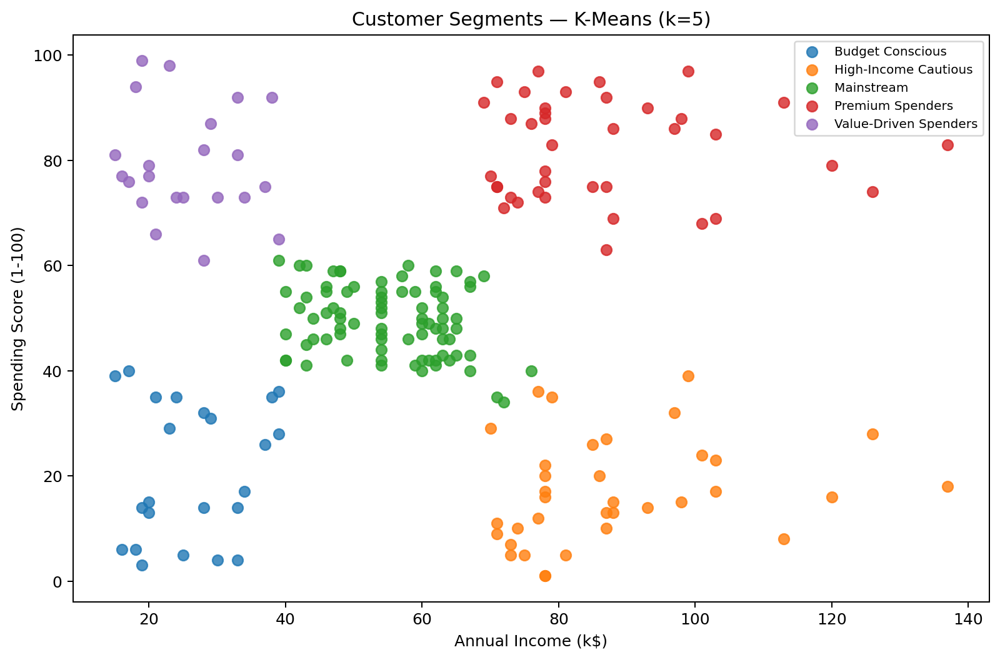

# 🛍️ Mall Customer Segmentation — Clustering with CRISP-DM

A compact end-to-end unsupervised learning project using the popular **Mall Customers Segmentation** dataset commonly used on Kaggle. The dataset contains **200 customers** with age, gender, annual income, and spending score.



## Business Goal
Segment mall customers into interpretable groups so marketing teams can tailor campaigns, loyalty offers, and retention strategies instead of treating all customers the same.

## CRISP-DM


1. **Business Understanding** — define actionable customer segments.
2. **Data Understanding** — inspect 200 customers, distributions, missingness, and feature relationships.
3. **Data Preparation** — remove identifier from modeling and standardize income + spending score.
4. **Modeling** — compare K-Means, Agglomerative Clustering, and DBSCAN.
5. **Evaluation** — use elbow analysis and silhouette score; prioritize both quality and business interpretability.
6. **Deployment / Dashboard** — deliver an executive-style admin dashboard and segment recommendations inside the notebook.

## Executed Results
- **Selected model:** K-Means
- **Selected k:** **5**
- **K-Means silhouette:** **0.555**
- **Best Agglomerative silhouette:** **0.554**
- **Best DBSCAN trial:** 0.586 silhouette, eps=0.20, 7 clusters, 38.5% noise



## Customer Segments

| Segment               |   Customers |   Share_% |   Avg_Age |   Avg_Income_k |   Avg_Spending |
|:----------------------|------------:|----------:|----------:|---------------:|---------------:|
| Mainstream            |          81 |      40.5 |      42.7 |           55.3 |           49.5 |
| Premium Spenders      |          39 |      19.5 |      32.7 |           86.5 |           82.1 |
| Value-Driven Spenders |          22 |      11   |      25.3 |           25.7 |           79.4 |
| High-Income Cautious  |          35 |      17.5 |      41.1 |           88.2 |           17.1 |
| Budget Conscious      |          23 |      11.5 |      45.2 |           26.3 |           20.9 |



## Business Actions
- **Premium Spenders:** protect with VIP/loyalty benefits and premium product launches.
- **High-Income Cautious:** use personalized bundles, quality messaging, and conversion campaigns.
- **Value-Driven Spenders:** promote affordable high-engagement offers and loyalty incentives.
- **Budget Conscious:** emphasize discounts and value-focused promotions.
- **Mainstream:** broad campaigns, cross-sell, and nurture toward higher-value behavior.

> Segment labels are business-friendly interpretations of cluster centers, not ground-truth customer classes.

## Dataset
Kaggle dataset: **Mall Customers Segmentation**. It has 200 rows and 5 columns with no missing values in the commonly distributed version.

The notebook downloads the CSV from a public GitHub mirror of the Kaggle dataset so the repository stays minimal.

## Run
```bash
pip install pandas numpy matplotlib scikit-learn
jupyter notebook mall_customer_clustering.ipynb
```

## Repository
```text
mall_customer_clustering_github_ready/
├── mall_customer_clustering.ipynb
├── README.md
├── prompt_used.md
└── images/
    ├── admin_dashboard.png
    ├── crisp_dm_workflow.png
    ├── customer_segments.png
    ├── model_selection.png
    └── segment_profiles.png
```
