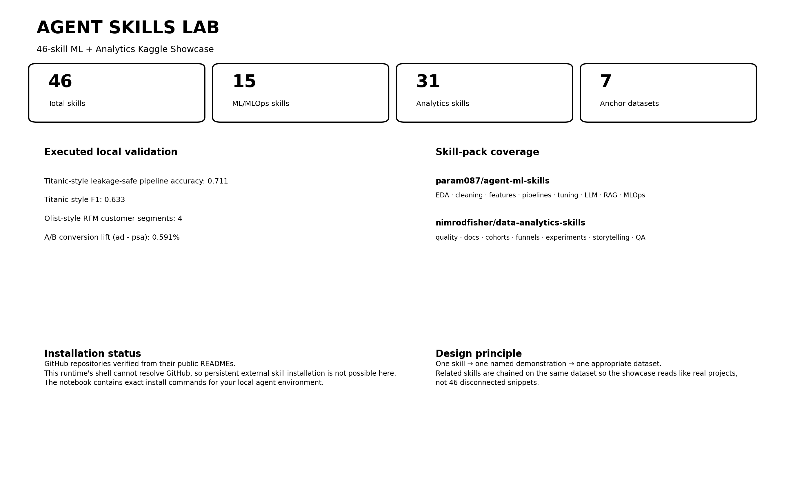
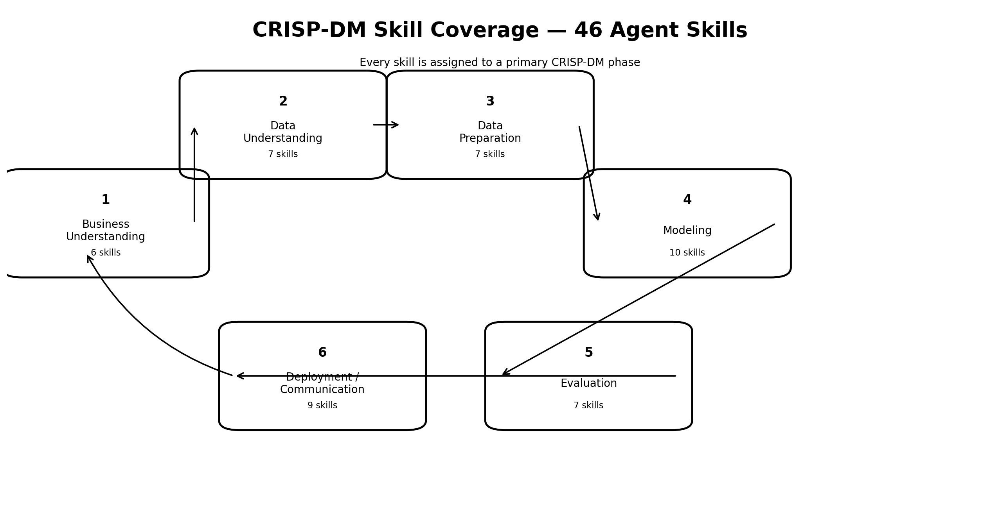
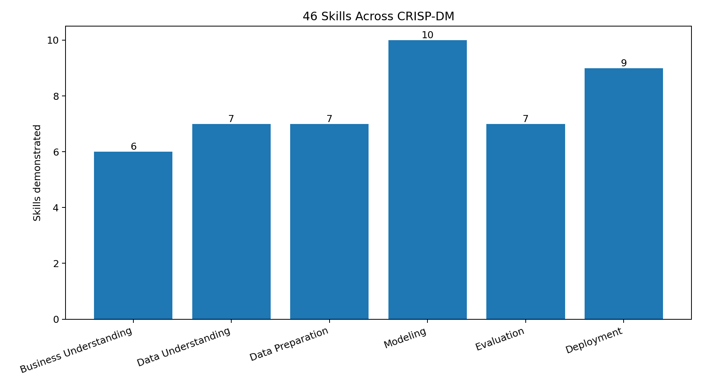
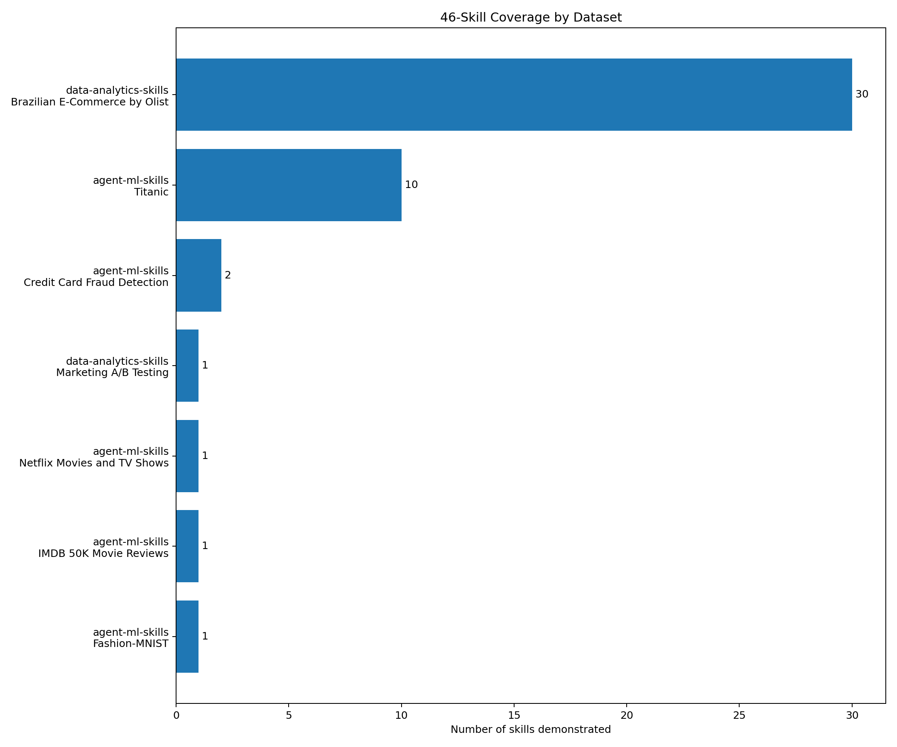
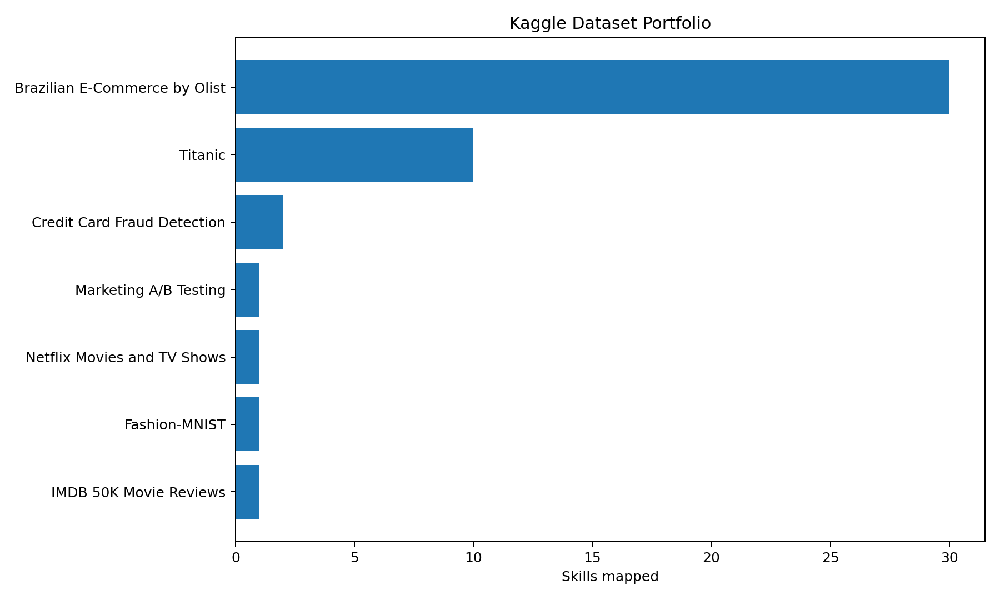
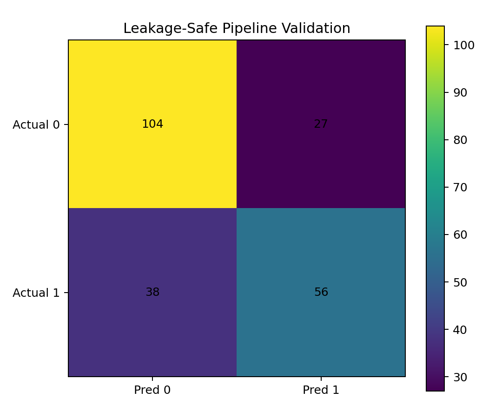
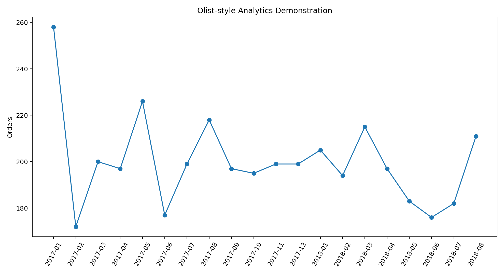

# 🧰 Agent ML + Data Analytics Skills — Kaggle Showcase

A single GitHub-ready project demonstrating **all 46 public skills** from:

- `param087/agent-ml-skills` — **15 skills**
- `nimrodfisher/data-analytics-skills` — **31 skills**



## Important installation note

The repositories were verified from their current public GitHub documentation, but this ChatGPT runtime's shell cannot resolve GitHub, so I could not persistently install the external skill files into ChatGPT itself.

Use these commands on your machine:

```bash
npx agent-ml-skills install --dir ./_installed_skills/agent-ml
git clone https://github.com/nimrodfisher/data-analytics-skills.git ./_installed_skills/data-analytics-skills
```

The notebook contains the installation section plus a **46/46 coverage audit**.


## CRISP-DM integration



| CRISP-DM phase | Skills |
|---|---:|
| Business Understanding | 6 |
| Data Understanding | 7 |
| Data Preparation | 7 |
| Modeling | 10 |
| Evaluation | 7 |
| Deployment / Communication | 9 |



The notebook ends with an automated quality gate verifying **46/46 skills and all 6 CRISP-DM phases**.

## Kaggle dataset portfolio

| Dataset | Main purpose |
|---|---|
| Titanic | Core ML workflow, pipelines, features, tuning, reproducibility, debugging, serving |
| Credit Card Fraud Detection | Imbalanced learning + fraud-aware evaluation |
| Fashion-MNIST | PyTorch training loop |
| IMDB 50K Movie Reviews | LLM fine-tuning |
| Netflix Movies and TV Shows | RAG |
| Brazilian E-Commerce Public Dataset by Olist | 30 analytics workflows |
| Marketing A/B Testing | Experiment analysis |

## Skill coverage





## Executed local validation

The project includes executable local fallbacks so the demonstrations can be sanity-checked without pretending they are Kaggle results.

- leakage-safe Titanic-style sklearn pipeline: **accuracy 0.711, F1 0.633**
- Olist-style RFM segmentation: **4 customer clusters**
- Marketing A/B-style absolute conversion lift: **0.591%**





## Repository structure

```text
agent_skills_kaggle_showcase_github_ready/
├── agent_skills_kaggle_showcase.ipynb
├── README.md
├── prompt_used.md
└── images/
    ├── admin_dashboard.png
    ├── dataset_portfolio.png
    ├── ml_pipeline_validation.png
    ├── olist_analytics.png
    └── skill_coverage.png
```

## Run

1. Open the notebook.
2. Run the install commands in an internet-enabled environment.
3. Download/mount the named Kaggle datasets.
4. Replace the clearly labeled local fallback dataframes with the actual Kaggle files.
5. Run all skill demonstrations.
6. Confirm the final **46/46 coverage audit**.

## Why one notebook?

Related skills are intentionally chained on the same datasets. For example, the Olist workflow moves naturally from:

`analysis-planning → EDA → quality audit → schema mapping → metrics → cohorts → segmentation → funnel → root cause → visualization → executive summary → QA → retrospective`

That demonstrates how the skills work together in a real analytics project.
