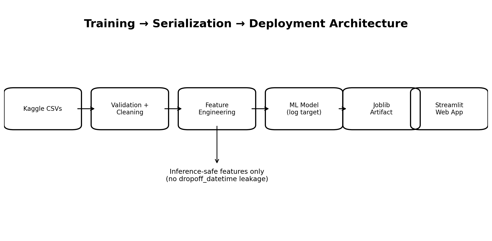
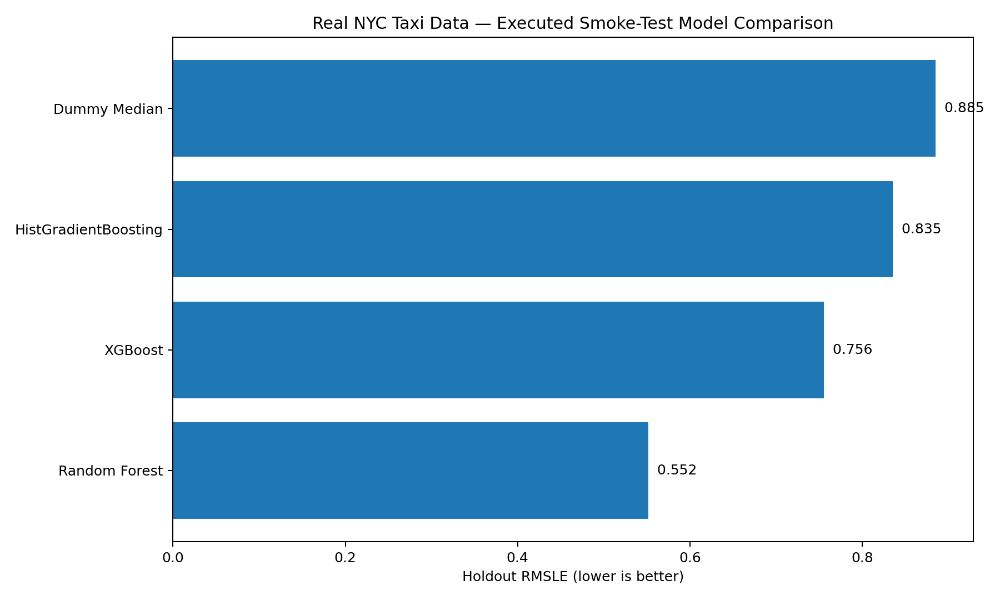
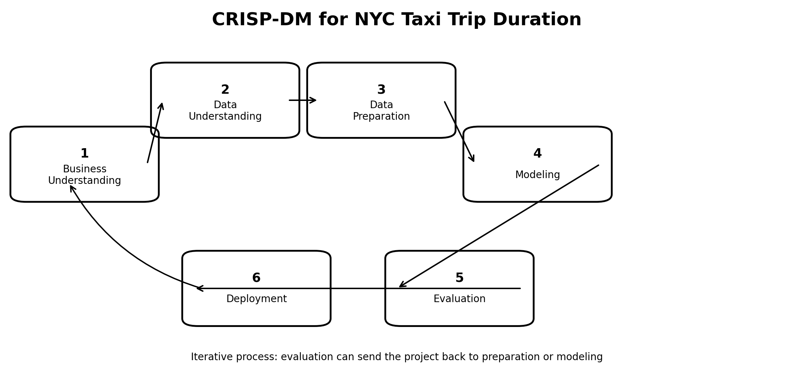
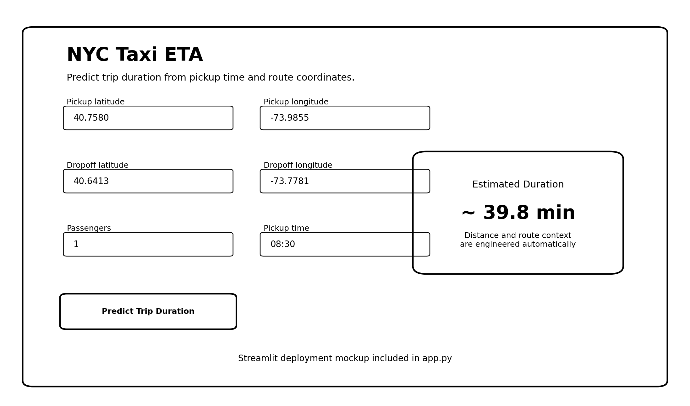
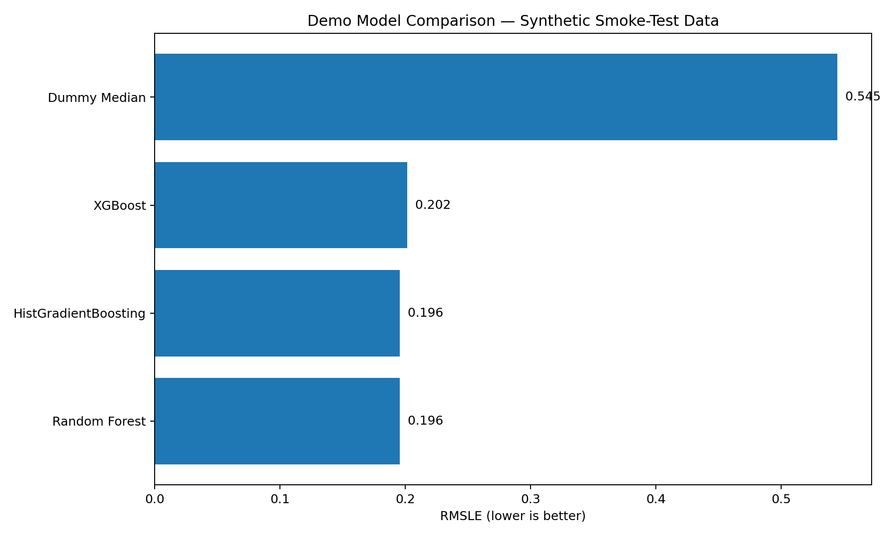
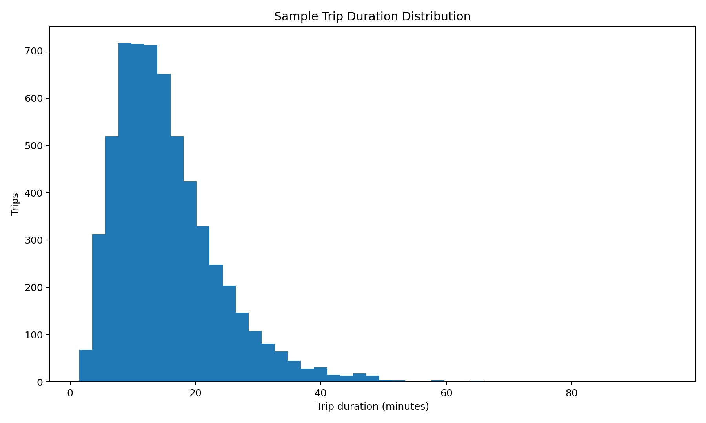
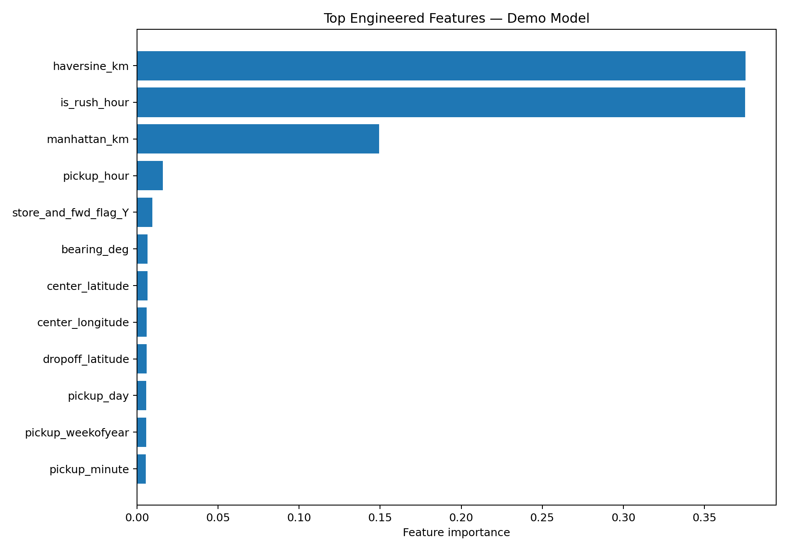

# 🚕 NYC Taxi Trip Duration — End-to-End Data Science Project


> Predict total New York City taxi trip duration using temporal, geospatial, passenger, and vendor information — from raw data to a deployable web app.




## ✅ Executed on real NYC taxi data

This repository is **not just a template**. A real-data smoke test was executed using an accessible public slice of the NYC Taxi Trip Duration competition-schema data.

- Real rows executed: **50**
- Best smoke-test model: **Random Forest**
- Holdout RMSLE: **0.5519**
- 5-fold CV log-RMSE: **0.5055 ± 0.0287**
- Full details: [`EXECUTED_RESULTS.md`](EXECUTED_RESULTS.md)

> These are real-data smoke-test results, **not Kaggle leaderboard results**. The sample is small, so the numbers should not be treated as final model performance.



## Highlights

- Complete **CRISP-DM** lifecycle
- Kaggle-compatible training and submission pipeline
- Leakage-aware modeling
- Temporal + geospatial feature engineering
- Dummy baseline, Random Forest, HistGradientBoosting, XGBoost
- RMSLE-aligned `log1p` target
- Cross-validation + light tuning
- Joblib model serialization
- Polished Streamlit front end
- Docker-ready deployment
- Synthetic schema-compatible sample data for instant smoke testing
- GitHub-ready prompt log, report, images, and documentation

## Competition

**Kaggle — New York City Taxi Trip Duration**

Target: `trip_duration` in seconds  
Evaluation: **RMSLE**

The full Kaggle CSVs are not redistributed in this repository. See [`data/README.md`](data/README.md).

## CRISP-DM



### 1. Business Understanding
Estimate trip duration from information available before the trip ends.

### 2. Data Understanding
Inspect schema, missingness, duplicates, target skew, time coverage, coordinates, passengers, and suspicious records.

### 3. Data Preparation
Engineer:

- month, day, weekday, hour, minute, ISO week
- weekend and rush-hour flags
- Haversine distance
- Manhattan-style distance
- bearing
- route-center coordinates
- vendor/passenger/store-forward fields

**Leakage protection:** `dropoff_datetime` is excluded because it is unknown at prediction time.

### 4. Modeling
Compare:
- Dummy median baseline
- Random Forest
- HistGradientBoosting
- XGBoost

Train on `log1p(trip_duration)` and convert predictions back with `expm1`.

### 5. Evaluation
Use RMSLE, cross-validation, restrained tuning, residual diagnostics, and feature importance.

### 6. Deployment
Serialize the final model with Joblib and serve it with Streamlit.



## Repository structure

```text
nyc_taxi_trip_duration_project/
├── app.py
├── CRISP_DM_REPORT.md
├── Dockerfile
├── PROMPT_USED.md
├── README.md
├── requirements.txt
├── download_data.sh
├── project_manifest.json
├── .gitignore
├── .streamlit/
│   └── config.toml
├── data/
│   ├── README.md
│   ├── sample_train.csv
│   └── sample_test.csv
├── images/
│   ├── app_preview.png
│   ├── crisp_dm_workflow.png
│   ├── feature_importance_demo.png
│   ├── model_comparison_demo.png
│   ├── sample_target_distribution.png
│   └── system_architecture.png
├── models/
│   └── taxi_duration_model.joblib
├── notebooks/
│   └── nyc_taxi_trip_duration_end_to_end.ipynb
├── outputs/
│   └── sample_submission_generated.csv
└── src/
    ├── __init__.py
    ├── features.py
    └── modeling.py
```

## Quick start

### Install

```bash
git clone <YOUR-REPO-URL>
cd nyc_taxi_trip_duration_project

python -m venv .venv
source .venv/bin/activate
# Windows: .venv\Scripts\activate

pip install -r requirements.txt
```

### Download official Kaggle data

After accepting the competition rules and configuring Kaggle credentials:

```bash
./download_data.sh
```

Expected:

```text
data/train.csv
data/test.csv
data/sample_submission.csv
```

If those are absent, the notebook uses the included synthetic sample data.

### Run the notebook

```bash
jupyter lab notebooks/nyc_taxi_trip_duration_end_to_end.ipynb
```

For laptop/Colab friendliness, the notebook caps official training rows by default. Set `MAX_TRAIN_ROWS = None` for full-data training.

### Run the front end

```bash
streamlit run app.py
```

The included Joblib artifact is a **demo model trained on synthetic data**. Running the notebook with official `train.csv` replaces it with an official-data-trained artifact.

## Demo model results

These are **synthetic smoke-test results only — not Kaggle scores**.

| Model | Demo RMSLE |
|---|---:|
| Random Forest | 0.1956 |
| HistGradientBoosting | 0.1957 |
| XGBoost | 0.2016 |
| Dummy Median | 0.5449 |



## Sample EDA





## Kaggle submission

The notebook writes:

```text
outputs/submission.csv
```

with:

```text
id,trip_duration
```

## Docker

```bash
docker build -t nyc-taxi-eta .
docker run -p 8501:8501 nyc-taxi-eta
```

Then open `http://localhost:8501`.

## Deployment targets

- Streamlit Community Cloud
- Render
- Railway
- Google Cloud Run
- AWS
- Azure
- any Docker-compatible platform

## Limitations

- Historical 2016 taxi data is not live traffic.
- Haversine and Manhattan-style distances approximate actual road travel.
- Geographic and temporal drift can reduce performance.
- Production use needs schema validation, monitoring, retraining, and uncertainty estimates.
- Never present included demo scores as Kaggle leaderboard performance.

## Future improvements

- OSRM / road-network route features
- weather and holiday features when permitted
- geohash / spatial clusters
- time-aware validation
- more systematic boosting tuning
- SHAP explainability
- prediction intervals
- drift monitoring and automated retraining

## Extra documentation

- [`CRISP_DM_REPORT.md`](CRISP_DM_REPORT.md)
- [`PROMPT_USED.md`](PROMPT_USED.md)
- [`data/README.md`](data/README.md)
