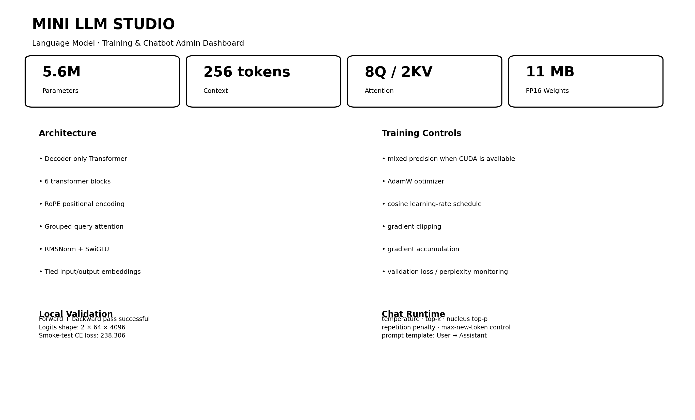
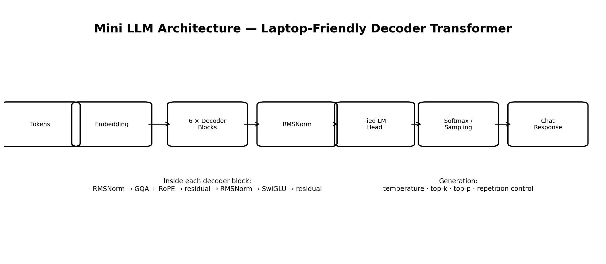
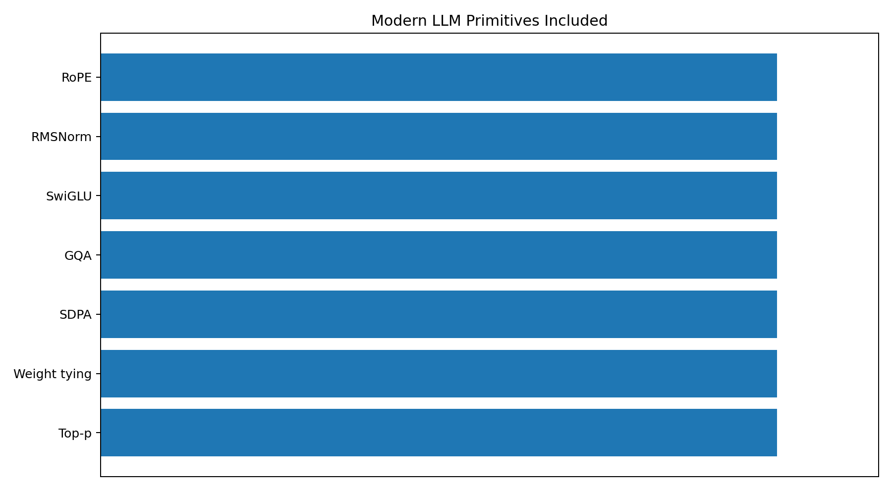
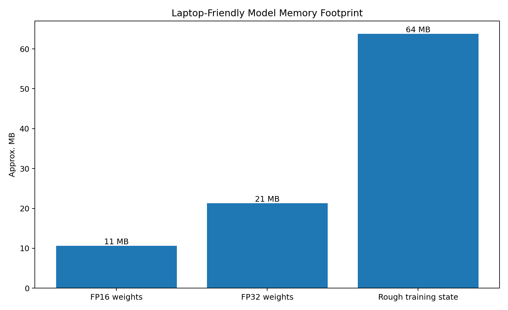
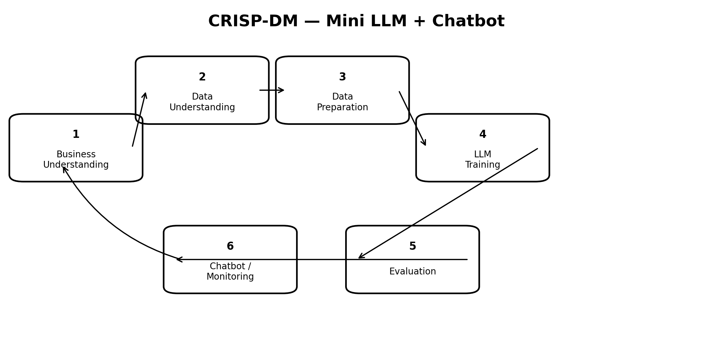
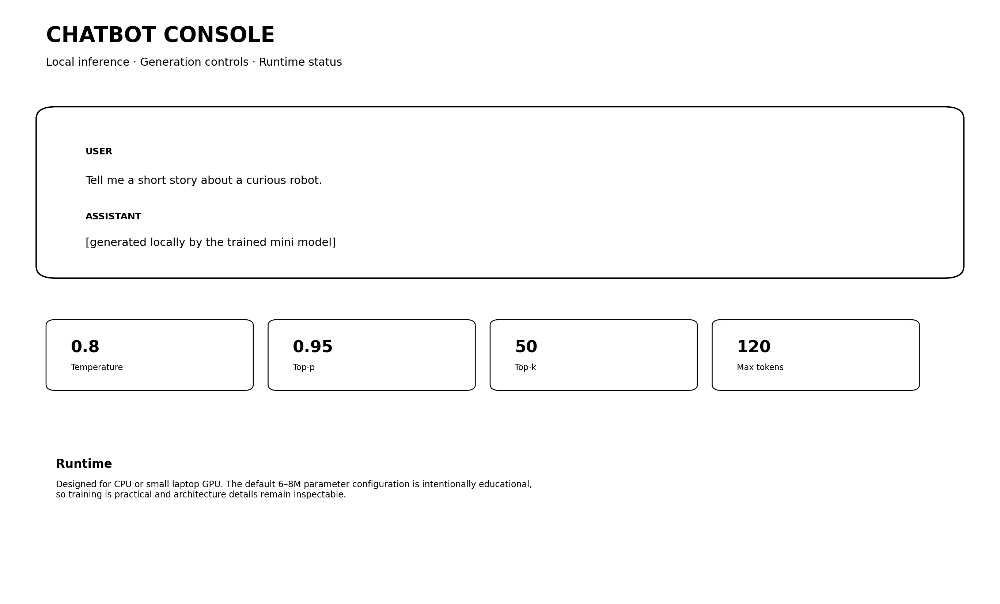

# 🧠 Mini LLM + Chatbot — Laptop-Friendly Transformer

> Build and train a small decoder-only language model from scratch with modern LLM primitives, then use it as a simple local chatbot.



## Highlights

- **~5.6M parameters** by default
- designed for a laptop GPU or CPU experiment
- TinyStories training pipeline
- byte-level BPE tokenizer
- decoder-only Transformer
- **RoPE**
- **RMSNorm**
- **SwiGLU**
- **Grouped-Query Attention**
- PyTorch scaled-dot-product attention
- weight tying
- AdamW
- cosine learning-rate schedule
- gradient clipping
- mixed precision on CUDA
- top-k + top-p sampling
- repetition penalty
- simple chatbot loop
- detailed **CRISP-DM**
- LLM admin + chatbot dashboards

## Local architecture validation

The model implementation was executed locally with a real forward and backward pass; the notebook now uses small GPT-style weight initialization for stable initial logits.

| Check | Result |
|---|---:|
| Parameters | **5,573,888** |
| FP16 model weights | **10.6 MB** |
| FP32 model weights | **21.3 MB** |
| Rough optimizer/training state | **63.8 MB** |
| Forward/backward | **Passed** |

The actual training notebook streams TinyStories and is intended to be run on the user's laptop or Google Colab.

## Architecture



### Model configuration

```python
dim = 256
n_layers = 6
n_heads = 8
n_kv_heads = 2
hidden_dim = 768
max_seq_len = 256
vocab_size = 4096
```

This keeps the model intentionally compact while still demonstrating modern architecture ideas.

## Modern primitives



### RoPE
Rotates query/key representations by position instead of adding learned absolute positional embeddings.

### RMSNorm
Efficient pre-normalization used before attention and feed-forward blocks.

### SwiGLU
Gated feed-forward network using SiLU activation.

### Grouped-Query Attention
Uses more query heads than key/value heads, reducing KV memory while preserving multi-head query capacity.

### Scaled-Dot-Product Attention
Uses PyTorch's optimized `scaled_dot_product_attention` primitive.

### Weight tying
Shares input embedding and output-language-head parameters.

## Memory



The model weights themselves are tiny compared with modern billion-parameter models. Training still needs additional memory for activations, gradients, and optimizer states.

## CRISP-DM



### 1. Business Understanding
Build an educational LLM that can be trained and inspected on consumer hardware.

### 2. Data Understanding
Use TinyStories, a corpus designed for studying small language models.

### 3. Data Preparation
Stream a configurable story subset, train a byte-level BPE tokenizer, concatenate stories, and create causal language-model sequences.

### 4. Modeling
Train a decoder-only Transformer with modern primitives and a laptop-friendly parameter budget.

### 5. Evaluation
Track validation loss, perplexity, generated samples, repetition, memory, and speed.

### 6. Deployment
Use the trained model through a `User → Assistant` prompt template and local chatbot loop.

## Admin Dashboard


## Chatbot Dashboard



## Dataset

The notebook uses **TinyStories**, a dataset specifically designed for experiments with small language models.

The notebook streams only a capped subset by default:

```python
MAX_STORIES = 8000
```

Increase this gradually if your GPU and training time allow.

## Laptop settings

Start with:

```python
BATCH_SIZE = 16
SEQ_LEN = 256
TRAIN_STEPS = 1200
```

If you run out of GPU memory, reduce `BATCH_SIZE` first.

### Smaller preset

```python
dim = 192
n_layers = 4
n_heads = 6
n_kv_heads = 2
hidden_dim = 576
```

### Larger laptop preset

```python
dim = 384
n_layers = 8
n_heads = 8
n_kv_heads = 2
hidden_dim = 1152
```

## Chat generation

The notebook includes:

```python
chat(
    "Tell me a short story about a friendly dragon.",
    temperature=0.8,
    top_p=0.95,
    top_k=50
)
```

and an interactive terminal loop.

## Repository structure

```text
mini_llm_chatbot_github_ready/
├── mini_llm_chatbot.ipynb
├── README.md
├── prompt_used.md
└── images/
    ├── admin_dashboard.png
    ├── chatbot_dashboard.png
    ├── crisp_dm_workflow.png
    ├── llm_architecture.png
    ├── memory_footprint.png
    └── modern_primitives.png
```

## Important limitation

A ~5.6M parameter model trained on TinyStories is an **educational language model**, not a factual general-purpose assistant. TinyStories-trained models learn simple story-style English and have deliberately limited knowledge.

## Next improvements

- small instruction-tuning stage
- true KV-cache generation
- FlashAttention-capable kernels where supported
- checkpoint saving/resume
- gradient checkpointing for larger presets
- evaluation on held-out prompt sets
- local Gradio/Streamlit interface
