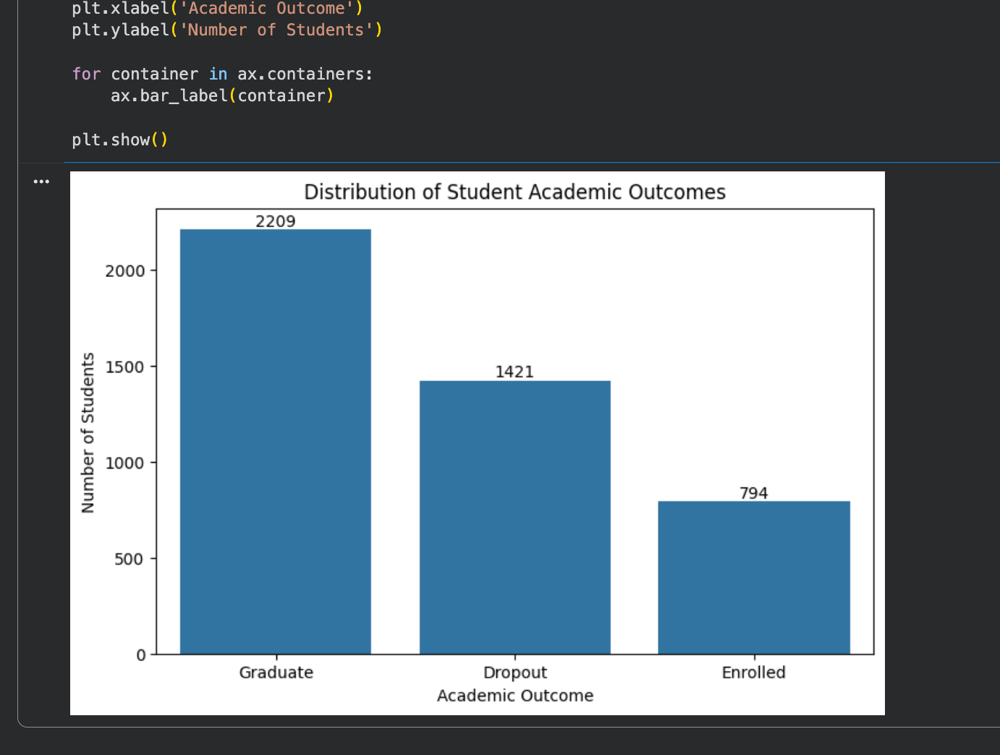
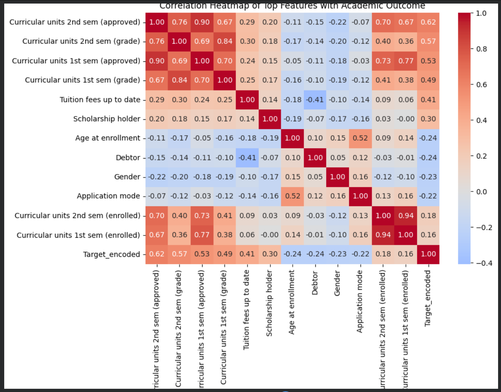
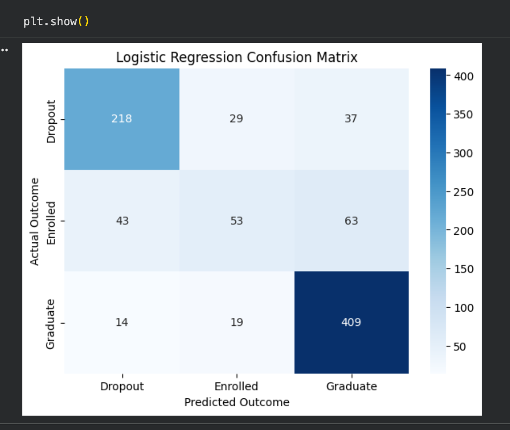
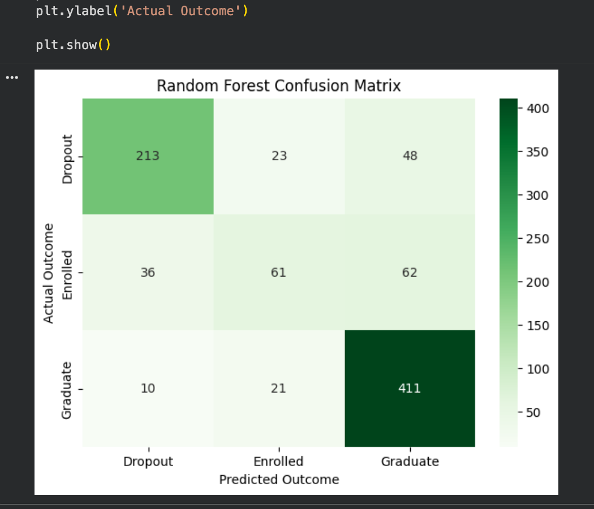
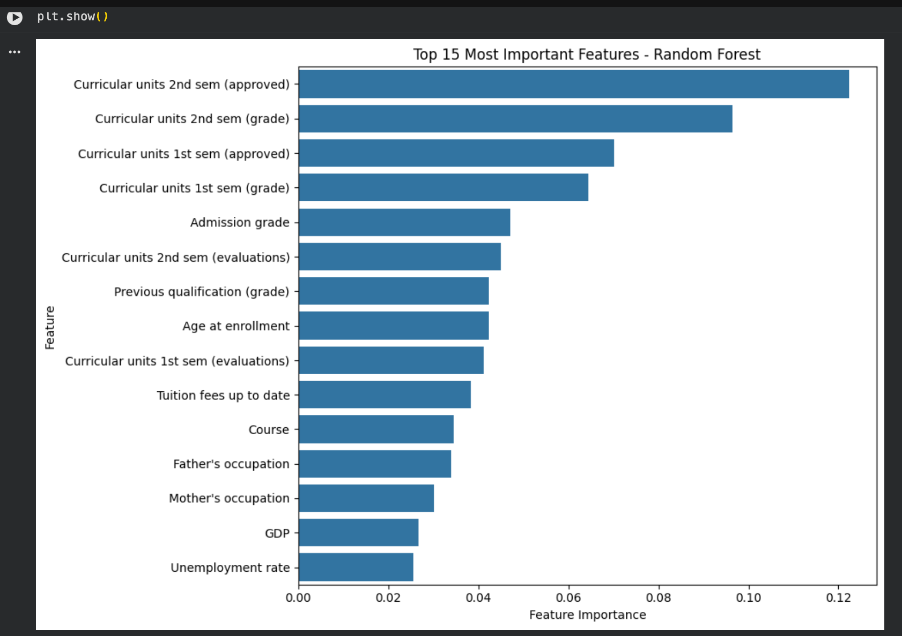
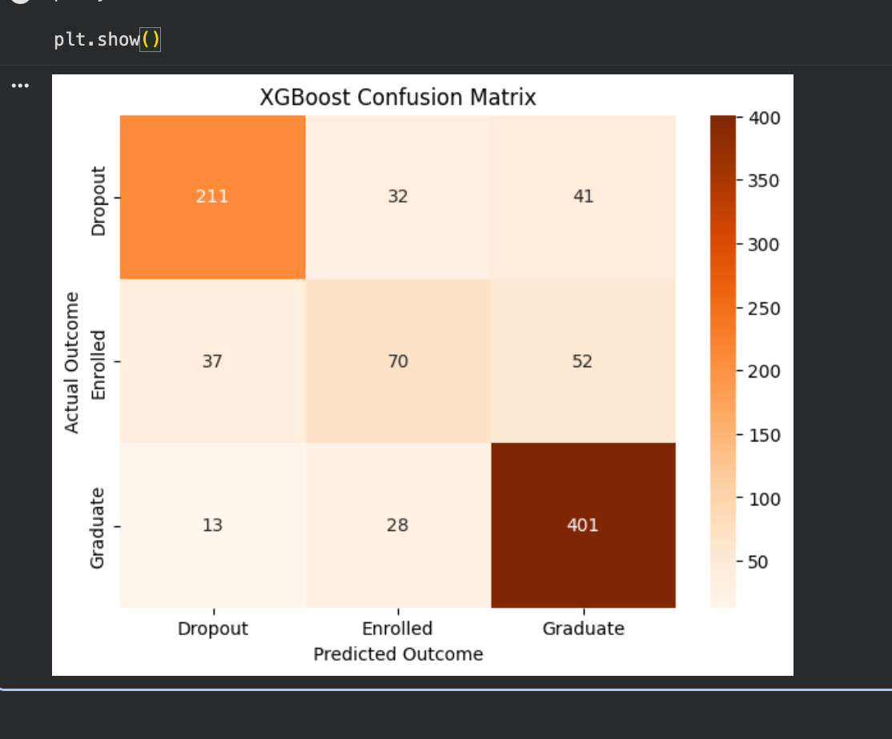
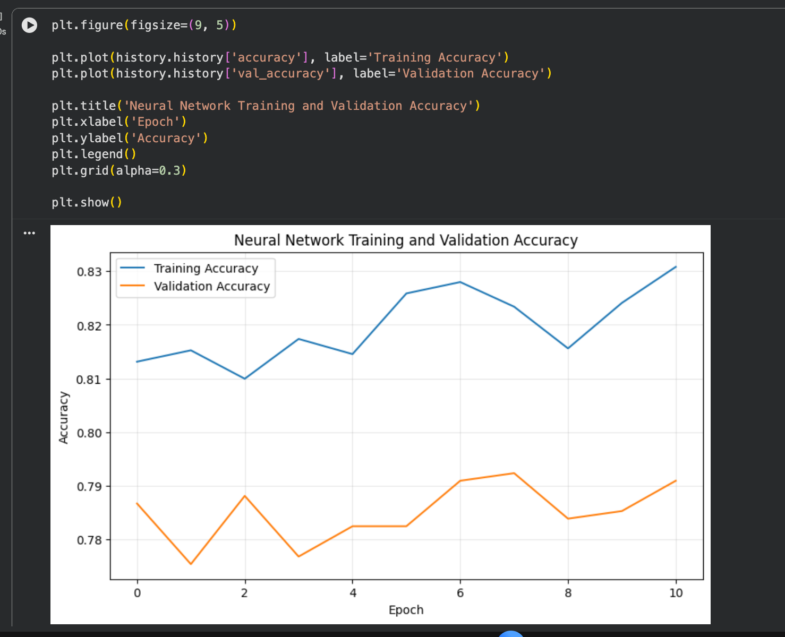
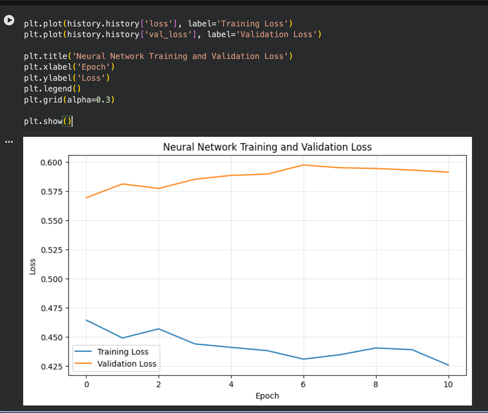
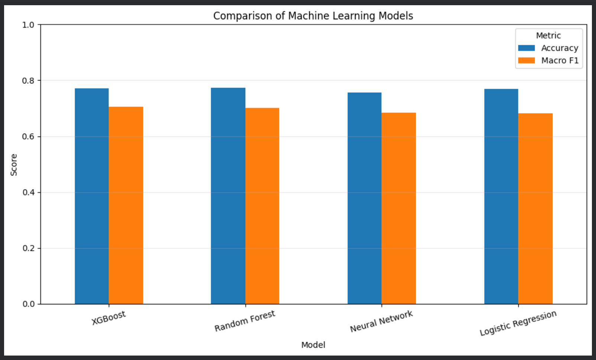

# 🎓 Predicting Student Dropout and Academic Success with Machine Learning

## CMPE 255 — Assignment 1

This project demonstrates an **end-to-end data science workflow assisted by ChatGPT**. The goal is to predict a university student's academic outcome as **Dropout**, **Enrolled**, or **Graduate** using demographic, socioeconomic, enrollment, and academic-performance features.

> **Project links**  
> 📝 Medium article: **[ADD YOUR MEDIUM ARTICLE URL HERE]**  
> 🎥 YouTube walkthrough: **[ADD YOUR YOUTUBE VIDEO URL HERE]**

---

## 📌 Project Overview

The dataset contains **4,424 student records**, **36 predictor features**, and one three-class target. The workflow covers data inspection, exploratory data analysis, preprocessing, correlation analysis, model training, model evaluation, feature importance, neural-network training, and final model comparison.

### Target distribution

- Graduate: **2,209**
- Dropout: **1,421**
- Enrolled: **794**



---

## 🔬 End-to-End Workflow

1. Loaded and inspected the student dataset.
2. Examined target distribution and student characteristics.
3. Encoded the target for correlation analysis.
4. Performed an 80/20 stratified train-test split.
5. Standardized features where appropriate using `StandardScaler`.
6. Trained Logistic Regression, Random Forest, XGBoost, and a feed-forward Neural Network.
7. Evaluated models using **Accuracy**, **Macro F1**, classification reports, and confusion matrices.
8. Examined Random Forest feature importance.
9. Compared all four models and interpreted the results.

---

## 📊 Correlation Analysis

Academic progress variables showed the strongest positive relationship with academic outcome. In particular, approved curricular units and semester grades were strongly associated with higher outcomes. Age at enrollment, debtor status, gender, and application mode showed negative correlations with the encoded outcome. These are associations and should not be interpreted as causal effects.



---

## 🤖 Models and Results

| Model | Accuracy | Macro F1 |
|---|---:|---:|
| **XGBoost** | 0.7706 | **0.7052** |
| **Random Forest** | **0.7740** | 0.7001 |
| Neural Network | 0.7559 | 0.6838 |
| Logistic Regression | 0.7684 | 0.6826 |

### Logistic Regression

Logistic Regression achieved **76.84% accuracy** and a **0.6826 Macro F1** score. It performed strongly for Graduate students but had more difficulty identifying the smaller Enrolled class.



### Random Forest

Random Forest achieved the **highest accuracy: 77.40%**, with a **0.7001 Macro F1** score.



Its feature-importance analysis showed that academic progress variables were among the strongest predictors, especially second-semester approved units and grades.



### XGBoost

XGBoost achieved **77.06% accuracy** and the **best Macro F1 score: 0.7052**. Because Macro F1 gives equal importance to each target class, XGBoost provided the best balanced performance among the tested models.



### Neural Network

The neural network used Dense layers with **128, 64, and 32 units**, ReLU activations, dropout regularization, and a three-class softmax output. It was trained with Adam, sparse categorical cross-entropy, and early stopping.

It achieved **75.59% accuracy** and a **0.6838 Macro F1** score. The training and validation curves suggest some overfitting: training performance continued improving while validation loss did not show the same improvement.





---

## 🏆 Final Model Comparison



The models produced similar overall accuracy, but Macro F1 exposed differences in their ability to handle all three classes. **Random Forest had the highest accuracy**, while **XGBoost had the highest Macro F1 score**. Since the Enrolled class is smaller and more difficult to predict, I selected **XGBoost as the best balanced model** for this experiment.

---

## 💡 Key Findings

- First- and second-semester academic performance was highly informative for predicting outcomes.
- Second-semester approved curricular units were the most important Random Forest feature.
- Financial indicators such as tuition-fee status also contributed useful information.
- The **Enrolled** class was consistently the hardest class for the models to identify.
- A neural network did not automatically outperform traditional machine-learning models on this structured tabular dataset.
- Accuracy alone can hide class-level weaknesses, so Macro F1 and confusion matrices were important parts of the evaluation.

---

## 🧰 Technologies Used

| Technology | Purpose |
|---|---|
| Python | Data science and machine learning |
| Google Colab | Notebook development environment |
| pandas / NumPy | Data manipulation |
| Matplotlib / Seaborn | Visualization |
| scikit-learn | Preprocessing, models, and evaluation |
| XGBoost | Gradient-boosted classification |
| TensorFlow / Keras | Neural network |
| ChatGPT | Coding and data-science assistance |
| GitHub | Project documentation and artifact hosting |

---

## 📁 Repository Structure

```text
Assignment-1-Student-Success-ML/
├── README.md
├── data.csv
├── Student_Dropout_Prediction_CMPE255.ipynb
├── images/
│   ├── target_distribution.png
│   ├── correlation_heatmap.png
│   ├── logistic_regression_confusion_matrix.png
│   ├── random_forest_confusion_matrix.png
│   ├── random_forest_feature_importance.png
│   ├── xgboost_confusion_matrix.png
│   ├── neural_network_accuracy.png
│   ├── neural_network_loss.png
│   └── model_comparison.png
└── report/
    └── Medium_Article_Student_Academic_Success.docx
```


---

## 🎥 Video Walkthrough

The YouTube video should highlight the complete end-to-end journey: dataset selection, EDA, preprocessing, model building, evaluation, comparison, and a short explanation of what the outputs mean.

**YouTube:** [ADD YOUR YOUTUBE VIDEO URL HERE]

## 📝 Medium Article

A reader-friendly version of the analysis is published on Medium.

**Medium:** [ADD YOUR MEDIUM ARTICLE URL HERE]

---

## 🔮 Future Improvements

Future work could explore hyperparameter tuning, additional class-balancing techniques, feature engineering, and cross-validation. Improving prediction of the Enrolled class would be a particularly useful next step.

---

## Acknowledgment

This project was completed as part of **CMPE 255 Assignment 1** using ChatGPT as a coding and data-science assistant throughout the end-to-end workflow.
